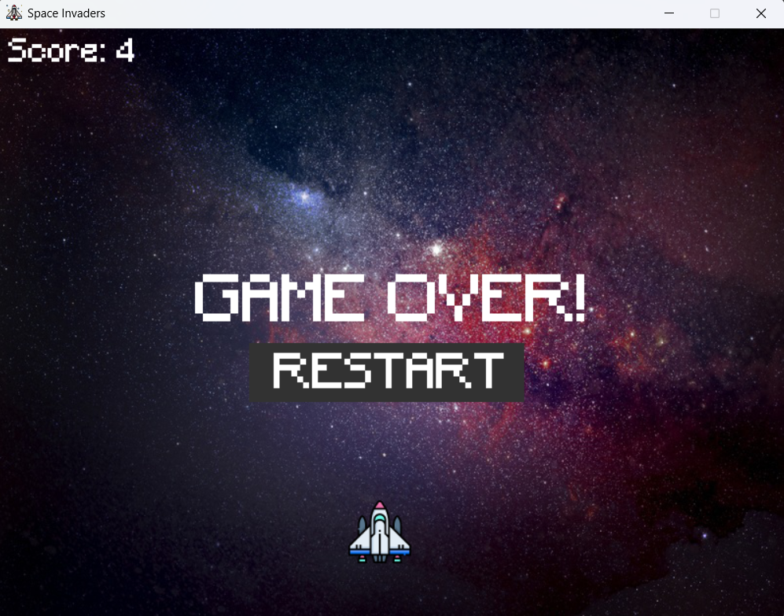

<p align="center">
  
  
  
</p>

# 👾 Space Invaders Clone in Python (Pygame)

A classic **Space Invaders** style game made using Python and the [Pygame](https://www.pygame.org/news) library.  
Move your spaceship, shoot down the invading enemies, and try to achieve the highest score possible!

---

## 🚀 Features
- Multiple enemies with random spawn positions
- Player-controlled spaceship with keyboard inputs
- Bullet firing system
- Collision detection & explosion sound effects
- Score display and game over screen with restart option
- Background music & sound effects

---

## 🎮 How to Play
- **Left / Right Arrow**: Move spaceship
- **Spacebar**: Fire bullet
- Destroy enemies to increase your score.  
- If an enemy crosses your defensive line... it’s game over!

---

## 🛠 Requirements
- Python 3.10+ 
- Pygame

Install Pygame via pip:
```bash
pip install pygame
```

---

## 💻 Running the Game
```bash
python main.py
```

---

## 📸 Screenshot
<p align="center">
  
  
</p>

---

## ✍️ Contributing
Want to improve this project? Contributions are welcome!

### 🚀 How to contribute
1. **Fork** this repository.
2. **Clone** your fork to your local machine.
    ```bash
    git clone https://github.com/yourusername/Space-Invaders-Clone.git
    ```
3. **Create a new branch** for your changes.
    ```bash
    git checkout -b feature-branch
    ```
4. Make your changes, commit, and push.
    ```bash
    git add .
    git commit -m "Add amazing feature"
    git push origin feature-branch
    ```
5. **Open a Pull Request** and describe what you’ve done.

---

## 📜 License
This project is licensed under the [MIT License](LICENSE).  
Feel free to use it, modify it, and build upon it for your own projects.

---

## ❤️ Credits
- Inspired by the classic **Space Invaders** arcade
- Learned from [freeCodeCamp](https://www.youtube.com/@freecodecamp)
- Developed by [Salil Dahiwalkar](https://github.com/Salildahiwalkar).
- Built using the [Pygame](https://www.pygame.org/news) library.


---

🚀 **Enjoy blasting aliens!**  
If you like this project, consider ⭐ starring the repo. 😊

